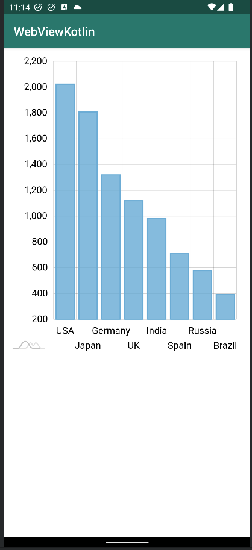

# Simple Example of Using Chart.js in a WebView on Android

This project demonstrates how to integrate Chart.js into an Android application using a WebView. It provides a basic example of displaying a chart within the app.

## Getting Started

1. Clone this repository.
2. Open the project in Android Studio.
3. Build and run the application on an Android device or emulator.

## How it Works

This project utilizes a WebView to display an embedded HTML file within the MainActivity class. This HTML file contains all the necessary HTML and JavaScript code to load and render the chart using the amCharts library.
The required amCharts library files are located in the assets/amcharts folder of the project. These files are accessed by the WebView to provide the charting functionality.
The WebView is then displayed within the MainActivity, allowing the chart to be rendered directly within the Android application. This approach provides a seamless integration of the chart into the app's user interface.

The WebView is then displayed within an Activity, allowing the chart to be rendered within the Android application.

## Customization

You can customize the chart by modifying the HTML file and the Chart.js configuration options. Refer to the Chart.js documentation for more details on customization.

## License

This project is licensed under the [MIT License](https://opensource.org/licenses/MIT).

Copyright (c) 2024 PhilippeSIS - Roger Philippe